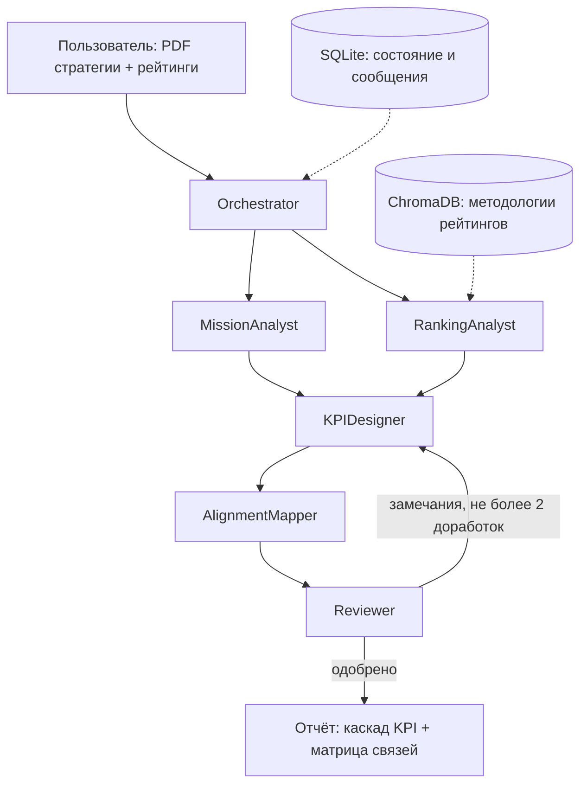

# Архитектура системы KPI Cascade

Схема взаимодействия: **оркестратор + конвейер с циклом проверки**. Все сообщения между агентами
проходят через оркестратор; агенты читают и пишут общее состояние задачи в SQLite.

## Поток выполнения

1. `main.py` создаёт `TaskRequest` (путь к документу, рейтинги, уровни каскада) и запускает `Orchestrator`.
2. Оркестратор записывает задачу в SQLite и **одним вызовом LLM** получает план (порядок агентов).
   План проверяется по таблице зависимостей; если он некорректен, используется стандартный план.
3. Оркестратор по очереди отправляет агентам `AgentMessage(type="task")` и получает
   `AgentMessage(type="result" | "review" | "error")`. Все сообщения сохраняются в таблицу `messages`.
4. MissionAnalyst выполняется раньше RankingAnalyst, т.к. RankingAnalyst ищет в методологиях
   фрагменты, близкие к стратегическим целям университета.
5. Если Reviewer вернул `needs_revision`, оркестратор ставит в очередь цикл
   KPIDesigner → AlignmentMapper → Reviewer (не более `MAX_REVISIONS` раз), передавая KPIDesigner
   замечания и предыдущую версию KPI.
6. Результат (`TaskResult`) сохраняется в `outputs/<task_id>/result.json` и `report.md`.

## Компоненты

| Слой | Модули | Назначение |
|---|---|---|
| Интерфейс | `main.py`, `app.py` | CLI и веб-интерфейс Streamlit: запуск, прогресс, результаты |
| Оркестрация | `core/orchestrator.py` | план, маршрутизация сообщений, лимиты, решение о доработке |
| Агенты | `agents/*.py` | предметная работа; общий класс `agents/base.py` |
| Инструменты | `tools/*.py` | `pdf_reader`, `vector_search`, `state_store`, `kpi_validator`, `coverage_calculator`, `openalex_stats` |
| LLM | `llm/client.py` | провайдеры `anthropic`, `openai`, `ollama`, `mock`; повторы через `tenacity` |
| Данные | `core/schemas.py`, `core/state.py` | Pydantic-модели; SQLite (`tasks`, `messages`, `artifacts`) |
| Наблюдаемость | `core/logger.py`, `scripts/load_report.py` | JSONL-логи, отчёт о нагрузке агентов |
| Проверка | `tests/`, `scripts/run_scenarios.py` | pytest и прогон тестовых сценариев |

## Внешние инструменты и источники данных

- **Файлы PDF** — стратегические документы (`pypdf`).
- **Векторная БД ChromaDB** — методологии рейтингов (`data/rankings/*.md`), эмбеддинги
  `paraphrase-multilingual-MiniLM-L12-v2`. Если модель нельзя скачать (нет интернета), используется
  офлайн-эмбеддер `hashing` (хеширование символьных триграмм) — см. `EMBEDDING_BACKEND` в `.env`.
- **SQLite** — явное состояние задачи.
- **OpenAlex API** — реальные публикационные показатели по стране (доля международного соавторства,
  открытого доступа, типичная публикационная активность университетов) для реалистичных целевых значений KPI.
  Ответы кэшируются в `data/cache/openalex.json`; при недоступности API KPIDesigner работает без них.

## Надёжность

| Механизм | Где | Настройка |
|---|---|---|
| Лимит шагов (вызовов агентов) | оркестратор | `MAX_STEPS=30` |
| Лимит доработок | оркестратор | `MAX_REVISIONS=2` |
| Лимит времени задачи | оркестратор (проверка перед каждым шагом) | `TASK_TIMEOUT_SEC=600` |
| Таймаут запроса к LLM | провайдеры | `LLM_TIMEOUT_SEC=60` |
| Повторы при сбоях LLM (экспоненциальная пауза) | `llm/client.py` | `LLM_MAX_RETRIES=3` |
| Повторный запрос при невалидном JSON (с текстом ошибки, ≤2 раз) | `agents/base.py` | — |
| Запрет повторного вызова агента с идентичным по существу входом (SHA-256 входа без служебных полей `iteration`, `validation`) | оркестратор | — |
| Перехват непредвиденных ошибок оркестратора → `TaskResult(status="failed")` | оркестратор | — |
| Повторы и кэш для OpenAlex; при недоступности — работа без справочных данных | `tools/openalex_stats.py` | `OPENALEX_*` |
| Базовая пауза между повторами | LLM, OpenAlex | `RETRY_BASE_SEC=1` |
| Понятное сообщение при сбое: агент, шаг, причина | `TaskResult.message` | — |

При исчерпании лимитов система не падает: возвращается `TaskResult` со статусом `partial`
(есть промежуточный результат) или `failed` (сбой до появления KPI).

## Учёт нагрузки (правило ≤40%)

В нагрузку агента входят его вызовы LLM (`llm_call`) и инструментов (`tool_call`).
Запись сообщений в таблицу `messages` выполняет транспортный слой оркестратора (как и запись логов) —
это событие `message`, оно не является предметным вызовом инструмента и в подсчёт не входит.
Оркестратор вызывает `state_store` для создания задачи, фиксации текущего шага и финального статуса.

Типовые прогоны на mock-провайдере (`python scripts/load_report.py`), с вызовом `openalex_stats`:

| Агент | univ_a (1 доработка) | univ_b (без доработок) |
|---|---|---|
| Orchestrator | 11 (28.2%) | 8 (30.8%) |
| MissionAnalyst | 3 (7.7%) | 3 (11.5%) |
| RankingAnalyst | 5 (12.8%) | 5 (19.2%) |
| KPIDesigner | 8 (20.5%) | 4 (15.4%) |
| AlignmentMapper | 6 (15.4%) | 3 (11.5%) |
| Reviewer | 6 (15.4%) | 3 (11.5%) |
